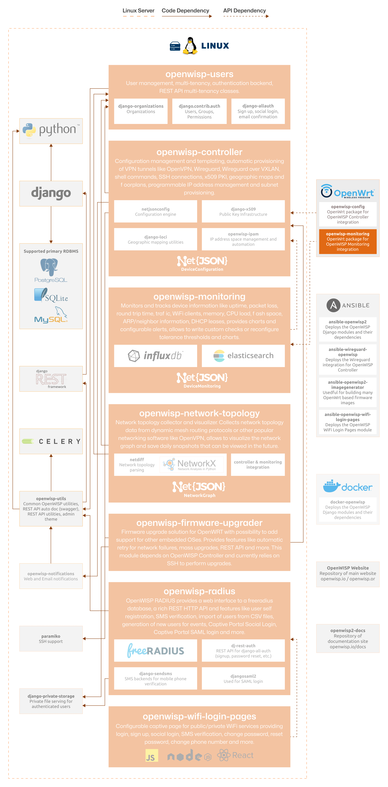

OpenWISP Monitoring Agent
=========================

.. seealso::

    **Source code**: `github.com/openwisp/openwrt-openwisp-monitoring
    <https://github.com/openwisp/openwrt-openwisp-monitoring>`_.

The OpenWISP Monitoring OpenWrt agent is responsible for collecting
monitoring metrics from network devices and sending them to a central
:doc:`OpenWISP Monitoring Server </monitoring/index>` via HTTPS, allowing
to collect critical network metrics without the need of a VPN.

These metrics include:

- General system information, uptime
- Interface traffic
- WiFi client statistics
- CPU load averages
- Memory usage
- Storage space and usage
- Cellular Modem Status, Cellular Signal Quality/Strength

By collecting this data, administrators gain valuable insights into
network health and performance, facilitating proactive troubleshooting of
potential issues.

The following diagram illustrates the role of OpenWrt Monitoring Agent
within the OpenWISP architecture.

    **OpenWISP Architecture: highlighted OpenWrt Monitoring Agent**

.. important::

    For an enhanced viewing experience, open the image above in a new
    browser tab.

    Refer to :doc:`/general/architecture` for more information.

.. toctree::
    :caption: User Docs
    :maxdepth: 1

    ./user/quickstart.rst
    ./user/settings.rst
    ./user/debugging.rst

.. toctree::
    :caption: Developer Docs
    :maxdepth: 2

    developer/installation.rst
